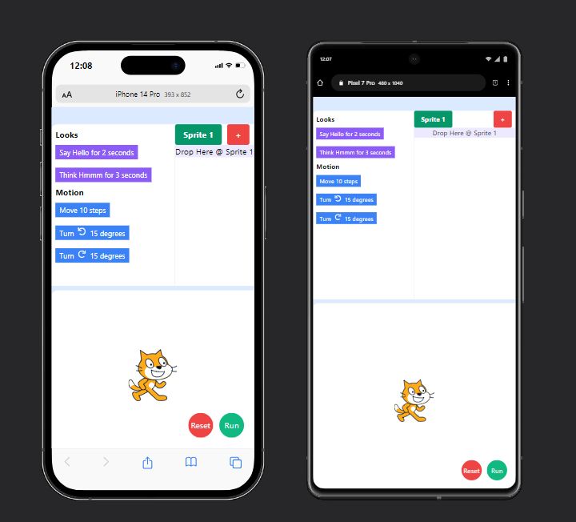
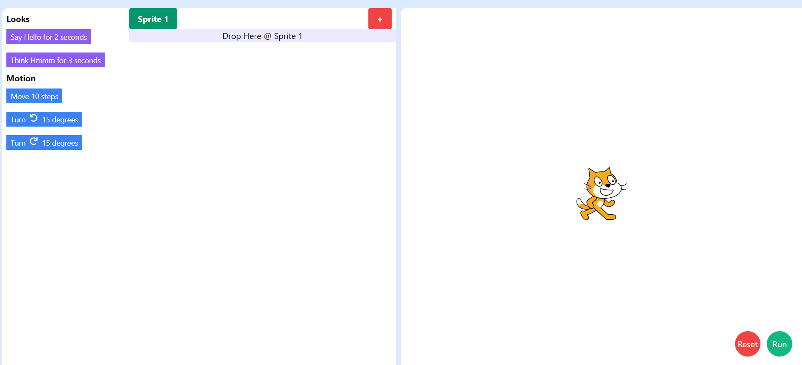

# React Application

## Deployed Link :- 
[App link](https://reactjs-challenge-eight.vercel.app/)

This project is a visual code editor for JavaScript inspired by MIT Scratch. The application allows users to drag and drop code blocks to create scripts, execute them on demand, and replay the history of actions performed on a sprite.

## Features

-   **Drag and Drop Functionality**: Users can drag and drop blocks from the toolbox into the scripting area.
-   **Motion and Looks Blocks**: Implemented blocks for basic motion and appearance changes.
-   **Replay Actions**: Users can replay the history of actions performed on the sprite.

## Technologies Used

-   **ReScript React**: For building the UI components.
-   **TailwindCSS**: For styling the application.
-   **react-dnd**: For implementing drag and drop functionality.

## Getting Started

Follow these instructions to set up and run the project locally.

### Prerequisites

-   Node.js (v14.x or later)
-   npm (v6.x or later)

### Installation

1. **Clone the Repository:**

    ```sh
    git clone https://github.com/yadav9452/react-challenge.git
    cd react-challenge
    ```

**Small Screen**



**Big Screen**


